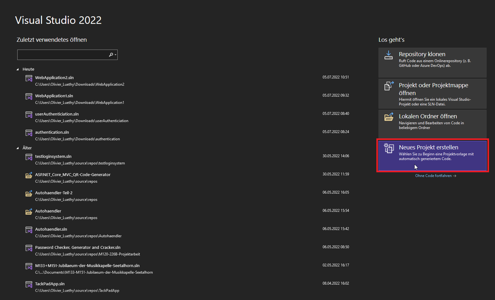
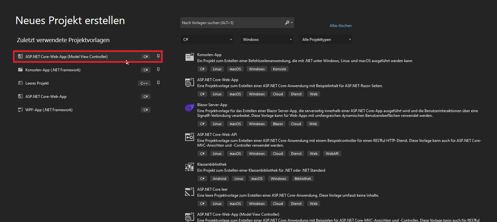
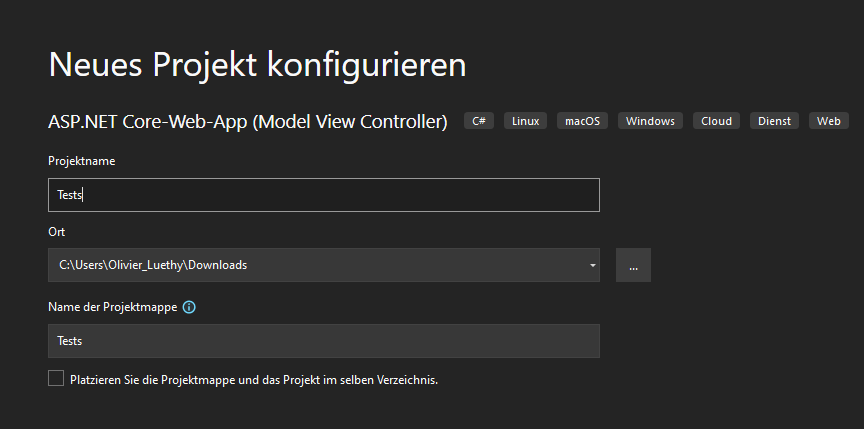
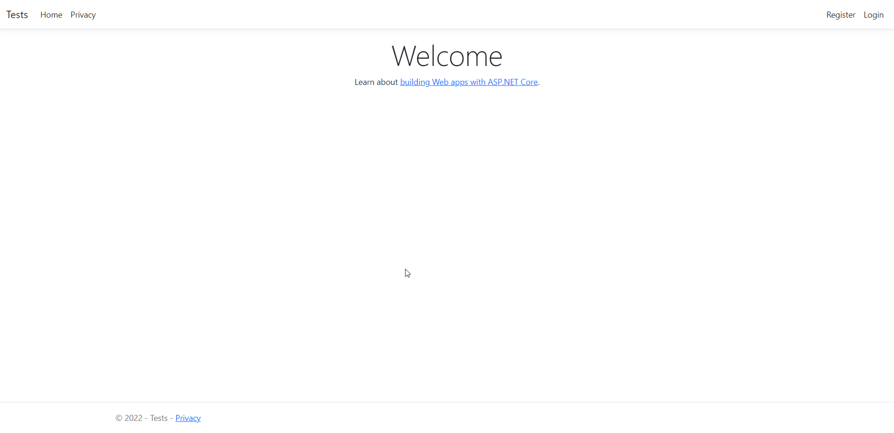

# UserAuthenticationInASP-NET
In diesem Readme wird erklärt, wie das ganze funktioniert, welche Fehler erschienen sind und wie man sie behebt.

## Vorgang
Die Version von Visual Studio sollte egal sein, aber in diesem Beispiel wird Visual Studio 2022 verwendet.
Nach dem Öffnen von Visual Studio muss ein neues Projekt erstellt werden.

In der Eingabe "ASP.NET Core-Web-App (Model View Controller)" auswählen. Man kann aber auch "ASP.NET Core-Web-App" eingeben. Danach kann man auch dort selber entscheiden, welche Vorlage man gerne nehmen würde.
</img>
Hier kann man nun den Projektnamen definieren, sowie dauch den Speicherort.
</img>
Hier muss man anschliessend als Framework die .NET Version 6 verwenden. Falls .NET 6 nicht mehr die neuste wäre, einfach die Neuste auswählen.
Zudem muss man als Authentifizierungstyp "Einzelne Konten" auswählen. Im Englischen wäre es "Individual User Accounts". Nun kann man das Projekt erstellen.
</img>
Nach dem Erstellen des Projekts kann man das Projekt ausführen. Nach der Ausführung sollte es in etwas so aussehen.
</img>

Das angeschaute Video um den Auftrag überarbeiten zu können:
https://www.youtube.com/watch?v=CzRM-hOe35o&t=849s

## Fehler
Falls bei beim Starten des Projekts ein Fehler auftaucht mit dem Fehler 
```sh
IOException: IDX20807: Unable to retrieve document from: 'System.String'. HttpResponseMessage:
```

Sollte man die zwei folgenden Befehle ausführen. 
```sh
dotnet tool install -g msidentity-app-sync
dotnet tool list -g
```

Warum, wüsste ich selber auch nicht. Für mehr Details muss man diesen Link besuchen: 
https://stackoverflow.com/questions/66865872/ioexception-idx20807-unable-to-retrieve-document-from-system-string-httpre